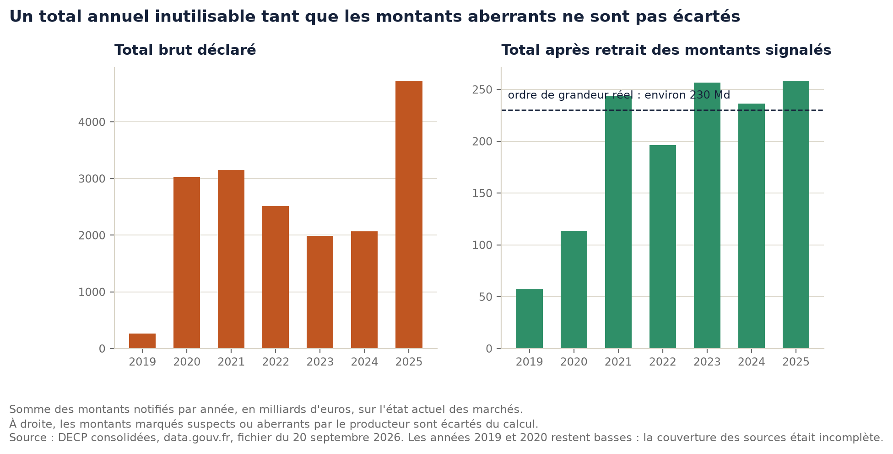
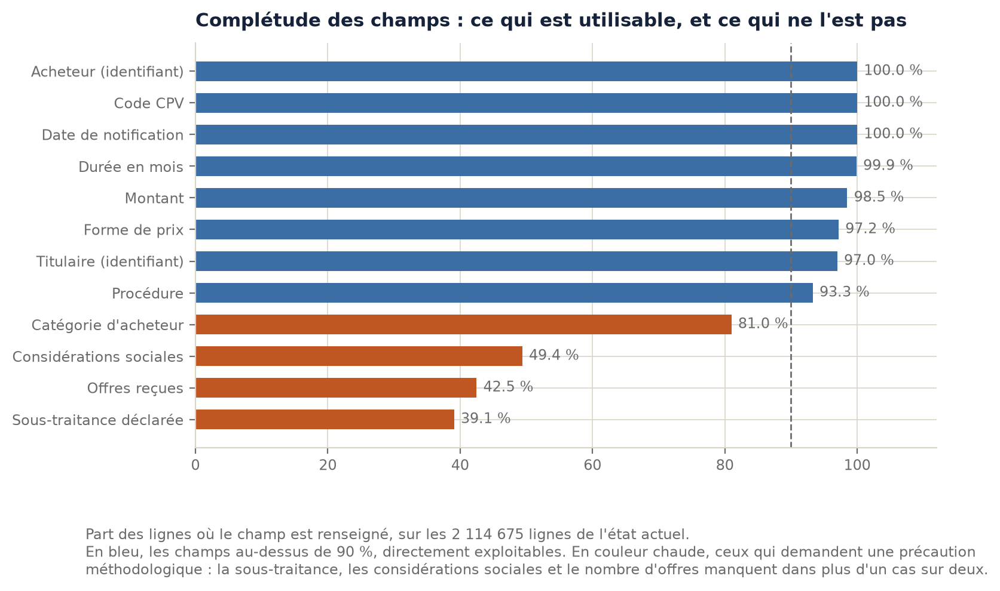
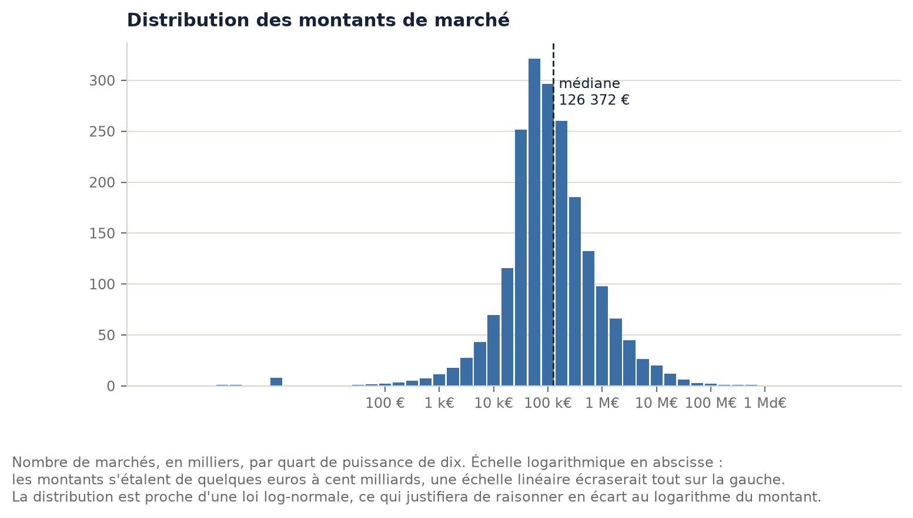
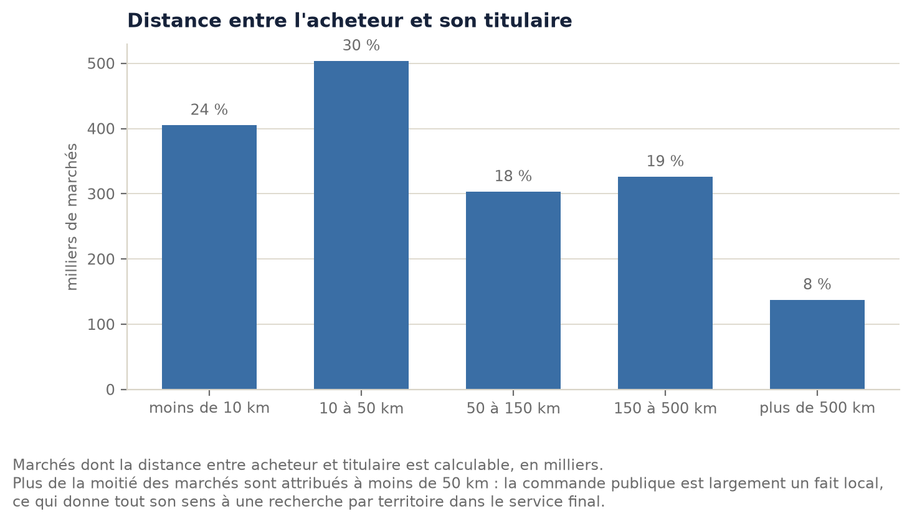
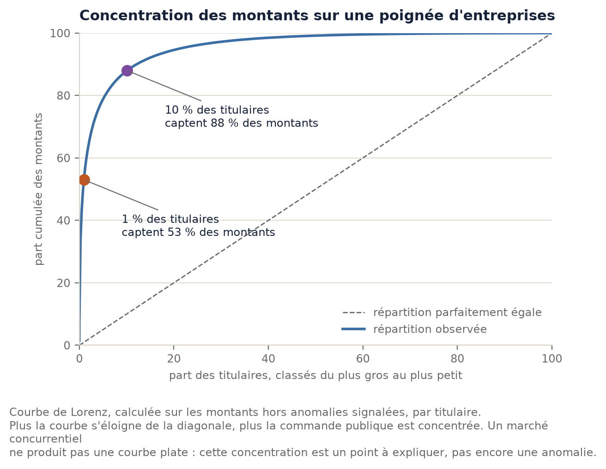
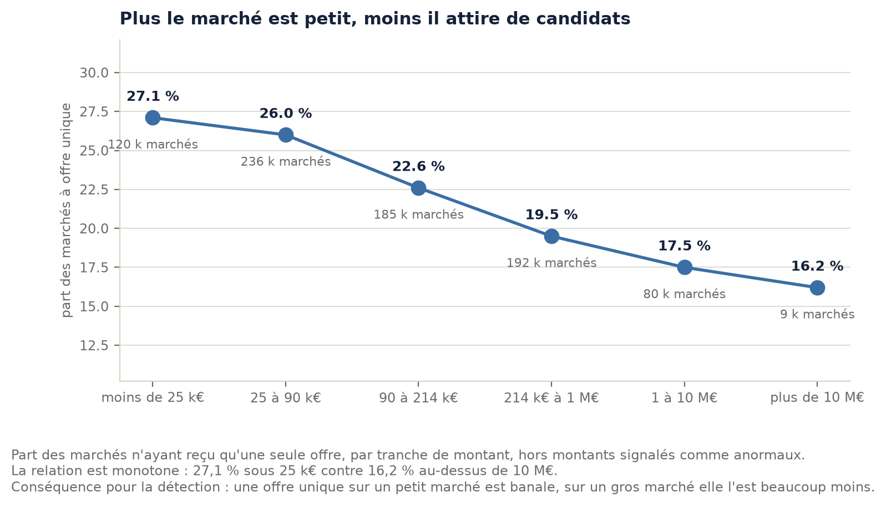

# Chapitre 2. État des lieux : des données publiques inexploitables en l'état

> Brouillon. Les faits, les chiffres et les sources sont vérifiés ; la formulation reste à
> reprendre dans la voix de l'auteur.

Ce chapitre établit le problème. Il montre d'abord ce que pèse la commande publique française et ce
que la loi oblige à en publier, puis il mesure ce que ces publications contiennent réellement.
L'écart entre les deux est le sujet de ce mémoire.

Tous les chiffres présentés comme des mesures proviennent d'un calcul exécuté sur les fichiers
publics, reproductible par une commande indiquée en note. Les chiffres cités d'ailleurs portent
leur source.

---

## 2.1 Un poids économique considérable, et mal connu

En 2024, l'Observatoire économique de la commande publique a recensé **223 383 contrats pour
233,3 milliards d'euros**[^oecp]. À titre de comparaison, c'est environ huit fois le budget annuel
du ministère de la Justice.

Cette dépense n'est pas concentrée à Paris. D'après le rapport de la commission d'enquête du Sénat
de juillet 2025, les collectivités territoriales représentaient en 2023 **80 % des marchés publics
en nombre, contre 8 % pour l'État**[^senat]. La commande publique est d'abord une affaire de
communes, de départements et de régions.

Elle est aussi, en partie, une affaire de petites entreprises. Les PME obtiennent **60 % des
contrats en nombre, mais seulement 25 % en montant**[^oecp]. Cette part en valeur recule : elle
était de 27,2 % en 2023.

Le même rapport sénatorial formule une réserve qui justifie à elle seule ce mémoire : « une part
substantielle des marchés publics, d'un faible montant, ne fait l'objet d'aucun recensement
précis »[^senat]. Autrement dit, l'État lui-même reconnaît qu'il connaît mal sa propre dépense.

---

## 2.2 Une obligation de publication, et deux canaux distincts

Depuis 2018, le code de la commande publique impose à tout acheteur de publier les **données
essentielles** de ses marchés : qui achète, à qui, pour quel objet, à quel montant, pour quelle
durée. C'est le dispositif DECP.

En parallèle, le **BOAMP** publie les avis : l'appel à concurrence avant la passation, le résultat
après. Édité par la DILA, il est accessible librement.

Les deux canaux ne racontent pas la même histoire :

| | DECP | BOAMP |
|---|---|---|
| Moment | après l'attribution | avant, puis après |
| Question à laquelle il répond | qui a obtenu quoi, pour combien | qu'est-ce qui est ouvert, jusqu'à quand |
| Utilité pour une PME qui cherche un marché | nulle, tout est déjà attribué | directe |
| Utilité pour analyser les prix | directe | faible, les montants y sont rares |

Cette complémentarité est la raison pour laquelle le projet exploite les deux. Le chapitre 6
montrera qu'elle est aussi une difficulté, puisque rien ne les relie formellement.

Les obligations dépendent de seuils, révisés tous les deux ans. En 2026, la publicité devient
obligatoire à 90 000 euros hors taxes, la procédure formalisée à 216 000 euros pour une
collectivité, et l'acheteur est dispensé de toute mise en concurrence en dessous de 60 000 euros
pour les fournitures et services[^seuils]. Un même marché change donc de régime, donc de visibilité,
selon son montant.

---

## 2.3 Ce que les fichiers contiennent réellement

Le jeu consolidé des DECP, publié quotidiennement sur data.gouv.fr, agrège 63 sources différentes.
Au 20 septembre 2026, il contient **3 283 035 lignes**, qui correspondent à **1 833 468 marchés
distincts**[^mesure-volume].

L'écart entre ces deux nombres n'est pas du bruit, et c'est le premier piège de lecture. Trois
phénomènes produisent plusieurs lignes pour un même marché :

- l'**historique des modifications** : chaque avenant ajoute une ligne ;
- les **groupements d'entreprises** : un marché attribué à trois sociétés occupe trois lignes ;
- les **vrais doublons**, c'est-à-dire la même information publiée deux fois.

La mesure sépare les trois : 273 494 cas de groupements, environ 7 800 doublons résiduels, et
**aucune ligne strictement identique à une autre** sur les 66 colonnes[^mesure-doublons]. Une
lecture rapide aurait conclu à 44 % de doublons ; la réalité est de l'ordre de 0,4 % des marchés.

La vérification de cette lecture est fournie par les données elles-mêmes : en ne conservant que
l'état actuel de chaque marché, on obtient exactement 1 833 468 marchés, soit le nombre publié par
le producteur. Notre compréhension du fichier est donc validée par un chiffre que nous n'avons pas
choisi.

---

## 2.4 Des défauts mesurables, et mesurés

### Le total annuel est faux d'un facteur dix à vingt

C'est le constat le plus spectaculaire, et le plus simple à vérifier. La somme brute des montants
déclarés donne **3 030 milliards d'euros pour 2020** et **4 725 milliards pour 2025**, alors que la
commande publique française pèse environ 233 milliards par an.

En écartant les seules lignes que le producteur signale déjà comme suspectes ou aberrantes, les
totaux retombent entre 196 et 258 milliards pour 2022 à 2025, c'est-à-dire dans l'ordre de grandeur
attendu[^mesure-totaux].

Il ne s'agit pas de falsification. Les données sont déclaratives, saisies par des milliers d'agents
dans des dizaines de logiciels différents, sans contrôle bloquant à la saisie. Le maximum observé,
99 999 999 999,99 euros, est une valeur de remplissage : quelqu'un a rempli le champ avec des neuf
pour pouvoir valider son formulaire.

Le détail des montants confirme le diagnostic : 48 596 lignes sans montant, 59 588 montants négatifs
ou nuls, dont un à moins 2 676 107 euros, et 2 197 au-dessus du milliard[^mesure-montants].

### Plus de la moitié des marchés n'indiquent pas le nombre d'offres reçues

C'est le défaut le plus lourd de conséquences. Le nombre d'offres reçues est l'indicateur de risque
le plus utilisé dans la littérature sur la commande publique, puisqu'un marché n'ayant reçu qu'une
offre n'a pas bénéficié d'une concurrence réelle.

Or ce champ n'est renseigné que pour **800 782 marchés sur 1 833 468, soit 43,7 %**[^mesure-offres].

Trois champs passent sous la barre de la moitié : la sous-traitance déclarée à 39,1 %, les
considérations sociales à 49,4 % et les offres reçues à 42,5 % des lignes. Un indicateur bâti sur un
champ rempli à 39 % ne mesure pas le phénomène visé : il mesure surtout qui prend la peine de
remplir le formulaire.

### Des dates impossibles et des durées absurdes

31 812 lignes n'ont pas de date de notification. La plus ancienne date du **1er janvier de l'an 1**,
valeur par défaut d'un champ mal rempli, et 1 441 lignes sont antérieures à 2015. Côté durées, la
médiane est de 24 mois, ce qui est plausible, mais 6 042 marchés dépassent dix ans et le maximum
atteint 32 000 mois, soit plus de 2 600 ans[^mesure-dates].

Ces cas se détectent avec une règle, pas avec un modèle : une date antérieure à une borne basse ou
une durée supérieure à un plafond raisonnable sont marquées comme invalides. **Marquées, et non
supprimées** : une ligne effacée ne peut plus être expliquée, ni corrigée par l'administration qui
l'a publiée.

### Un même concept écrit de douze façons

La nature du marché s'écrit `Marché`, `MARCHE`, `MARCHÉ`, `marché` selon la source. Douze écritures
pour sept notions réelles. C'est la conséquence directe de l'agrégation de 63 sources, chacune avec
ses habitudes de saisie.

Deux fonctions SQL, mise en majuscules et retrait des accents, en regroupent l'essentiel en quelques
millisecondes. Le résultat montre aussi la limite de l'approche : `ACCORD-CADRE` et `ACCORD CADRE`
restent séparés par un simple tiret. La marche suivante reste une règle, pas un modèle.

---

## 2.5 Ce que ces données permettent, et ce qu'elles interdisent

Une fois ces défauts connus, la forme des données apparaît, et elle est riche.

**La commande publique est faite de petits marchés.** La médiane s'établit à 126 372 euros et 63 %
des marchés sont sous 214 000 euros, le seuil européen applicable aux collectivités. La distribution
suit une loi log-normale, ce qui commande de raisonner sur le logarithme des montants plutôt que sur
les montants eux-mêmes.

**Elle suit le calendrier budgétaire.** Décembre et juillet sont les pics de notification, août le
creux, et ce motif se répète chaque année depuis 2019. Toute détection d'anomalie devra comparer un
marché à ses pairs du même mois, faute de quoi chaque mois de décembre serait signalé.

**Elle est largement locale.** Plus de la moitié des marchés sont attribués à une entreprise située
à moins de 50 kilomètres de l'acheteur.

**Elle est fortement concentrée.** 1 % des titulaires captent 53 % des montants, et 10 % en captent
88 %[^mesure-concentration].

Ce constat demande une précaution de lecture. Une telle concentration n'établit ni entente ni
favoritisme : les grands marchés d'infrastructure ne peuvent être exécutés que par de grandes
entreprises, et le phénomène s'observe dans tous les pays. C'est un fait de structure, qui devient
intéressant lorsqu'on l'observe **à l'échelle d'un acheteur** plutôt qu'à l'échelle nationale.

**La concurrence dépend du montant.** La part de marchés à offre unique décroît régulièrement avec
la taille du marché, de 27,1 % sous 25 000 euros à 16,2 % au-dessus de 10 millions.

C'est un résultat décisif pour la suite : le signal utile n'est pas « une seule offre », mais
**l'écart au comportement attendu de sa catégorie**. Une offre unique sur un petit marché de voirie
communale est banale ; sur un marché à dix millions d'euros, elle l'est beaucoup moins.

---

## 2.6 Deux sources qui ne se rejoignent pas

Le BOAMP compte 1 707 999 avis publiés entre le 2 mars 2015 et aujourd'hui, dont 1 160 935 avis de
marché et 465 999 résultats de marché. Au moment de la mesure, **8 014 appels d'offres étaient
ouverts**, et le délai médian laissé aux entreprises pour répondre était de **31 jours**[^mesure-boamp].

Relier ces avis aux marchés des DECP donnerait la chaîne complète, de l'appel d'offres jusqu'au
montant attribué. La mesure montre que c'est impossible par simple jointure : sur 600 avis récents
portant un identifiant de dossier, **aucun ne correspond à un identifiant des DECP**[^mesure-lien].

L'explication tient à la fabrication des identifiants. Le BOAMP porte un identifiant technique
produit par la plateforme de dématérialisation de l'acheteur, sous forme d'UUID. Les DECP portent un
identifiant choisi par l'acheteur, souvent un numéro de dossier interne, combiné à son SIRET. Les
deux désignent le même marché sans jamais se rencontrer.

Relier les deux sources sera donc un **rapprochement d'enregistrements** et non une jointure : même
SIRET d'acheteur, dates proches, objets similaires, avec une part d'incertitude à mesurer et à
publier. Le SIRET de l'acheteur, présent des deux côtés, en est le point d'ancrage.

---

## 2.7 Le problème, formulé

Trois usages sont aujourd'hui empêchés, chacun pour une raison mesurée.

**Pour une PME qui cherche un marché.** L'information existe, dispersée entre un bulletin d'annonces
et des fichiers de plusieurs gigaoctets. Les 8 014 avis ouverts ne sont pas filtrables par métier et
par territoire sans outil dédié, et rien ne relie un appel d'offres ouvert aux prix pratiqués
auparavant pour le même type de prestation.

**Pour un citoyen ou un journaliste.** Le chiffre le plus élémentaire, la dépense annuelle, est faux
d'un facteur dix à vingt dans les fichiers publiés. Toute analyse commence donc par un travail de
nettoyage que rien ne documente publiquement.

**Pour un chercheur ou un contrôleur.** L'indicateur de risque le plus établi de la littérature
manque dans 56 % des marchés, et les deux sources principales ne se joignent pas.

Le problème n'est donc pas l'absence de données ouvertes : la France en publie beaucoup, et depuis
longtemps. **Le problème est que la publication n'a jamais été suivie d'une chaîne de traitement
outillée, mesurée et reproductible.** C'est cette chaîne que ce mémoire construit, et dont il
démontre qu'elle tient pour quelques euros par mois avec des outils libres.

---

[^oecp]: Observatoire économique de la commande publique, chiffres 2024 publiés le 25 novembre 2025.
Repris par Seban Avocats, « Panorama de la commande publique : les chiffres de 2024 », et par
achat-logistique.info, « 233,2 milliards d'euros d'achats publics en 2024 », 26 novembre 2025.

[^senat]: Sénat, commission d'enquête, rapport n° 830 (2024-2025), « L'urgence d'agir pour éviter la
sortie de route : piloter la commande publique au service de la souveraineté économique »,
8 juillet 2025, https://www.senat.fr/rap/r24-830-1/r24-830-10.html

[^seuils]: Seuils applicables en 2026. Voir chapitre 1, note sur les seuils.

[^mesure-volume]: Mesure propre, `make bench-decp`, fichier du 20 septembre 2026. Résultats
complets dans `mesures/resultats/2026-09-20-decp-qualite.json`.

[^mesure-doublons]: Idem. Détail de la décomposition dans `analyses/01-exploration-decp.ipynb`.

[^mesure-totaux]: Mesure propre, `make bench-decp-distributions`. Agrégat
`mesures/resultats/montants-total-annuel.csv`.

[^mesure-montants]: Mesure propre, `make bench-decp`.

[^mesure-offres]: Mesure propre, `make bench-decp`. Le champ est renseigné sur 899 298 lignes, soit
42,5 % des 2 114 675 lignes à l'état actuel, et 800 782 marchés distincts, soit 43,7 % des
1 833 468 marchés.

[^mesure-dates]: Mesure propre, `make bench-decp`.

[^mesure-concentration]: Mesure propre, `make bench-decp-distributions`. Agrégat
`mesures/resultats/concentration-titulaires.csv`, calculé hors montants signalés comme anormaux.

[^mesure-boamp]: Mesure propre, API BOAMP, 21 septembre 2026.
Notebook `analyses/04-exploration-boamp.ipynb`.

[^mesure-lien]: Idem. Test sur les 600 avis les plus récents portant un `contractfolderid`.
